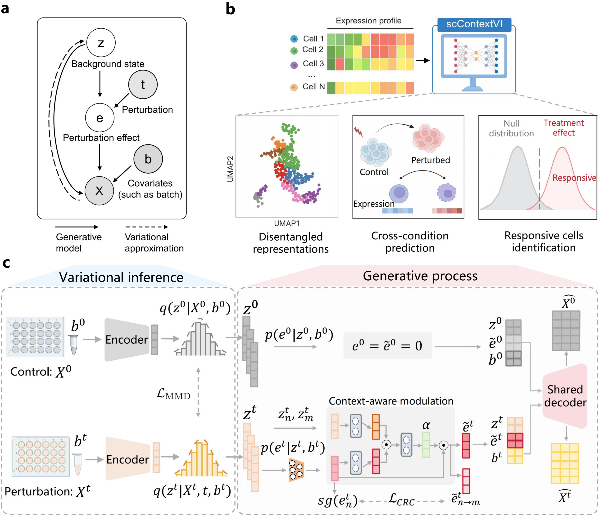

# scContextVI
scContextVI is an unsupervised generative framework for disentangling background cellular state and perturbation effects, enabling cross-condition prediction and characterization of response heterogeneity at single-cell resolution.

### Overview of framework 


### Installation
```bash
pip install -r requirements.txt
```

### Data availability

The processed datasets used in this study are available from the following sources:

Download the datasets and place them in the `data/` directory. Update the data paths in the corresponding scripts or notebooks before running the analyses.
